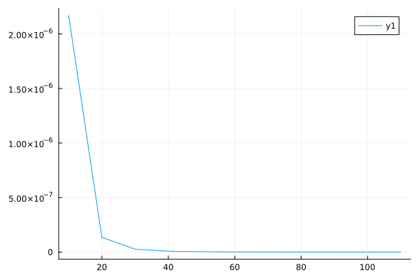

# Gauss-Legendrove kvadrature

Funkcija `Gauss_legendre` se uporablja za numerično aproksimacijo določenih integralov z uporabo Gauss-Legendre kvadrature. Funckija vzame vhodno funkcijo `f`, število `n`, ki predstavlja število podintervalov in meji `a` in `b`. Nato razdeli interval v `n` podintervalov in uporabi Gauss.Legendreovo kvadraturno metodo na vsakem podintervalu za izračun integrala.

